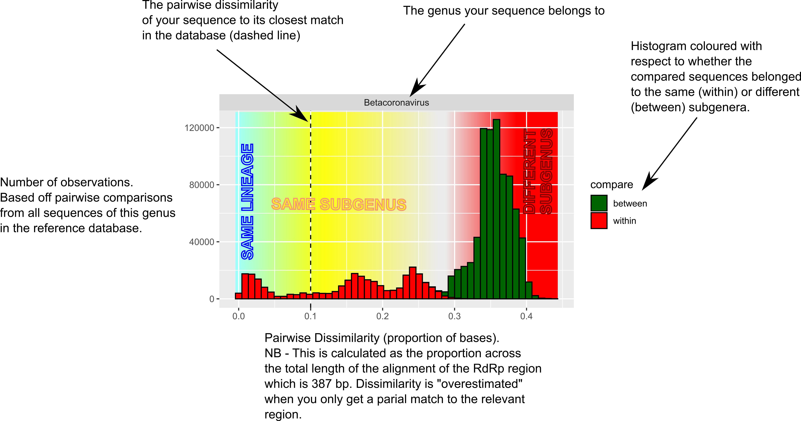

## MyCoV installation:

The ‘MyCoV’ package will currently only work in a linux environment.
Essentially it is a wrapper script for nucleotide BLAST, and therefore requires a local installation of BLAST+.

On Ubuntu, this can be installed via terminal as such:

>  sudo apt-get install ncbi-blast+

In R, you will need to install ‘MyCoV’ via github using the ‘devtools’ package.

There are various dependencies for devtools and the other packages used by MyCoV.

From a fresh install of ubuntu (tested in Ubuntu 19, and assuming you already have R), the following series of commands works to install MyCoV.

1) Install dependencies in terminal:

>sudo apt-get install libxml2-dev

>sudo apt-get install libssl-dev

>sudo apt-get install libcurl4-openssl-dev

>sudo apt-get install libmagick++-dev

 
2) In R, install the devtools package:

>install.packages(“devtools”)

 
3) In R, install MyCoV:

>devtools::install_github(“dw974/MyCoV”)

>library(MyCoV)

## Using MyCoV

To run MyCoV, you just need a fasta file containing the sequences you wish to query.
The file can contain any number of sequences.

>res=MyCoV(fasta=”query_sequences.fas”)

This generates a dataframe (res) containing the results of blast searches against the Coronavirus reference data set.

Then you can tabulate the results through the 'formattable' package:

>tabulate_CoV(df=res)

This will give you something that looks like this:

To interpret this:

"query": the name of the sequence in the query fasta file.

"best_hit": the sequence that showed the closest identity in the reference database.

"predicted_subgenus": the subgenus to which the best_hit sequence was assigned in the phylogenetic analyses in our paper.

"predicted_genus": the genus to which the best_hit sequence was assigned in the phylogenetic analyses in our paper.

"posterior_probability": the proportion of trees in our bayesian inference in which the best_hit sequence clustered in the same group as the corresponding subgenus holotype sequence.

"pairwise_identity": pairwise identity between the query sequence and the bet_hit sequence in the reference database.

"recombination": Whether the best_hit sequence also had a sequence in the spike region that gave a different classification result due to recombination.

Alternatively, you can visualise the results in terms of best-hit pairwise distances to the query sequence(s):

>tabulate_CoV(df=res)

This will generate something like this:

MyCoV also allows you to visualise the relationship between a single query sequence and all sequences in the reference database, whilst also providing a summary of the host and geographical origin of the metadata associated with the reference database sequences.

>plot_similarity(fasta="query_sequence.fasta")

This will give you something that looks like this:

The tree presented here is a subtree of the main phylogenetic analysis comparing more than 3000 unique coronavirus sequences that is presented in the paper. The metadata are compiled from more than 7000 isolates.

The subtree presented is the lowest branch of the main tree that contains all of the isolates that return blast hits to the queried sequence.

Pairwise identities to each sequence are shown on the tips, and the tips are coloured with respect to identity. The best hit is highlighted by a large diamond tip. Predicted subgenus classifications of all tips are shown.

To the right, a presence/absence summary of the metadata associated with each tip is displayed. The idea of this is that it is possible to rapidly assess the associations made by sequences that are similar to the one you are querying.

I hope you enjoy using the package.

## CITING MyCoV

OUR PAPER

and if you use the output of ggtree:

- Guangchuang Yu. Using ggtree to visualize data on tree-like structures. Current Protocols in Bioinformatics, 2020, 69:e96. doi:10.1002/cpbi.96

- Guangchuang Yu, Tommy Tsan-Yuk Lam, Huachen Zhu, Yi Guan. Two methods for mapping and visualizing associated data on phylogeny using ggtree. Molecular Biology and Evolution 2018, 35(12):3041-3043. doi:10.1093/molbev/msy194

- Guangchuang Yu, David Smith, Huachen Zhu, Yi Guan, Tommy Tsan-Yuk Lam. ggtree: an R package for visualization and annotation of phylogenetic trees with their covariates and other associated data. Methods in Ecology and Evolution 2017, 8(1):28-36. doi:10.1111/2041-210X.12628
